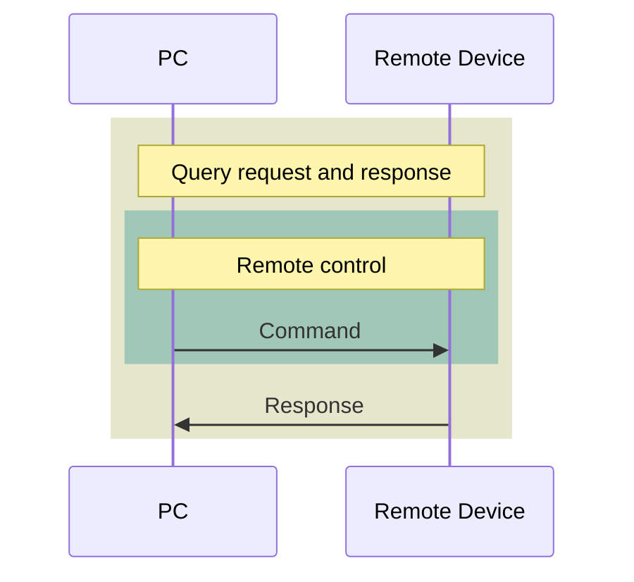
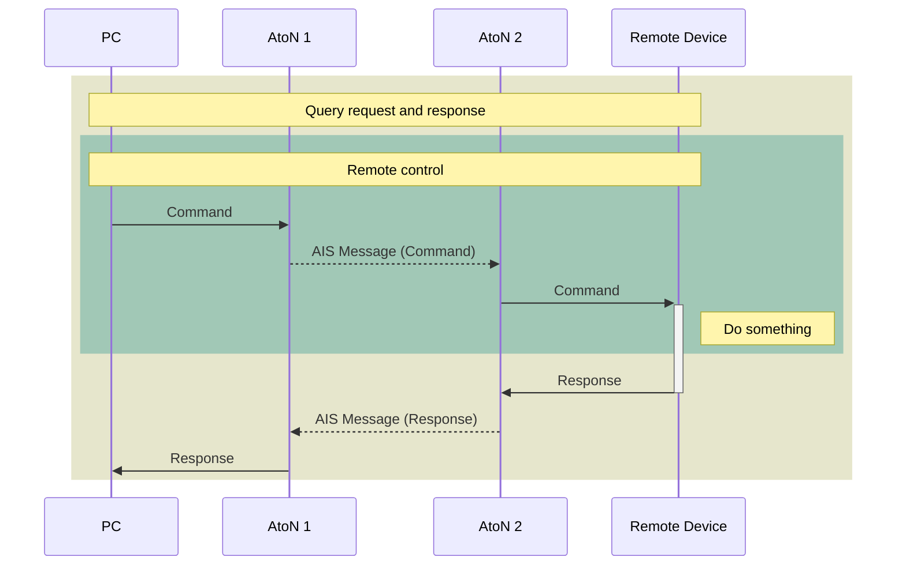
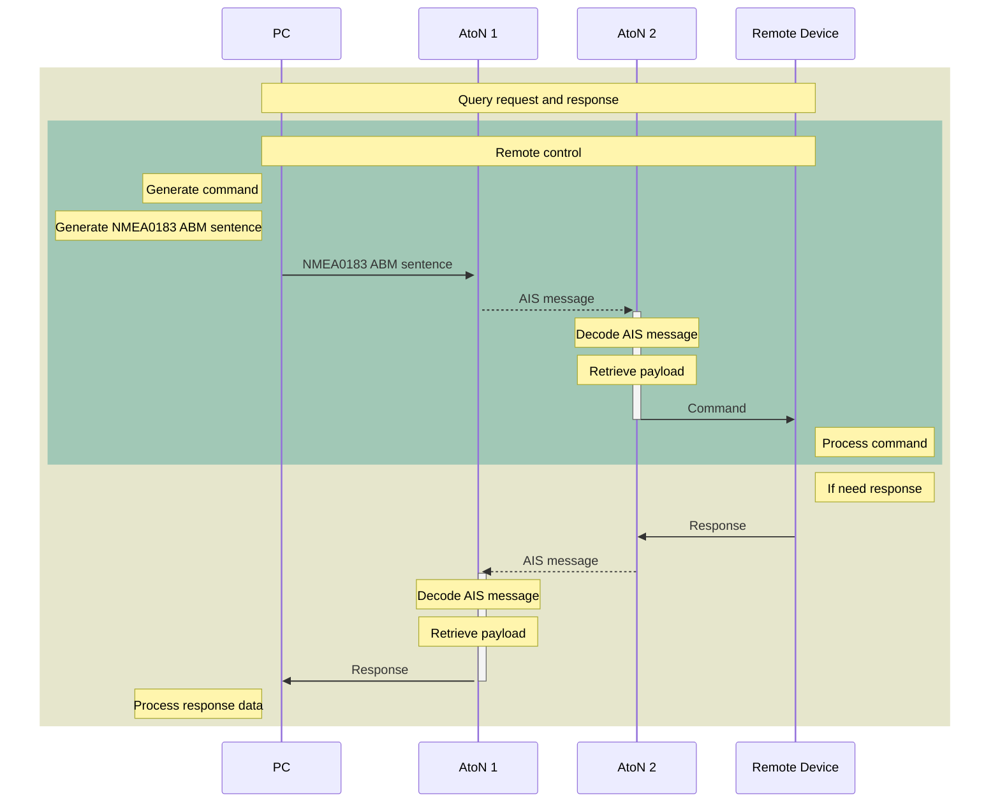
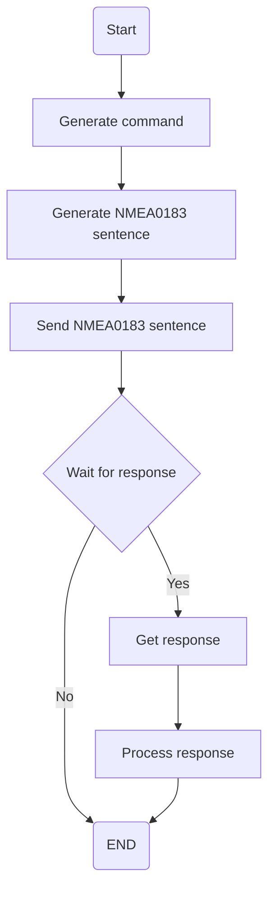
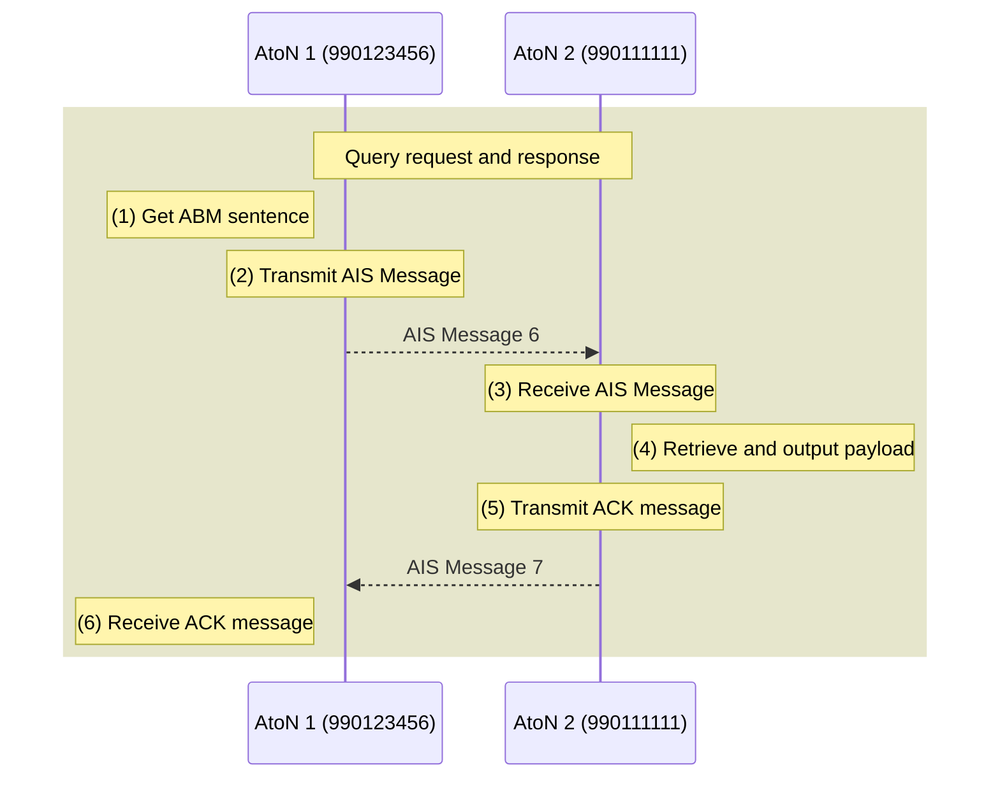
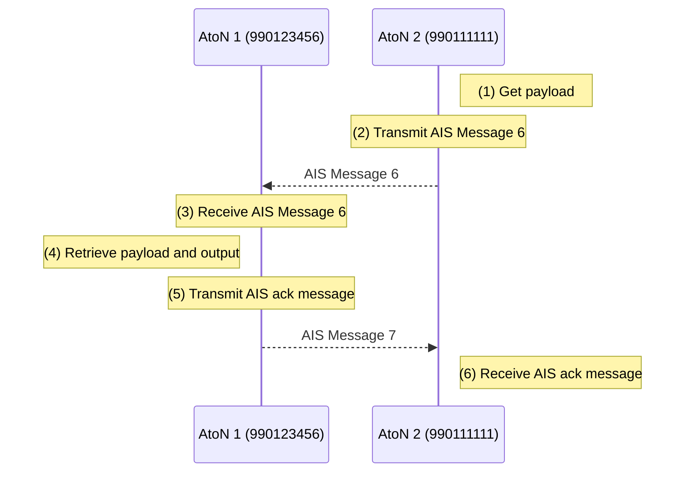
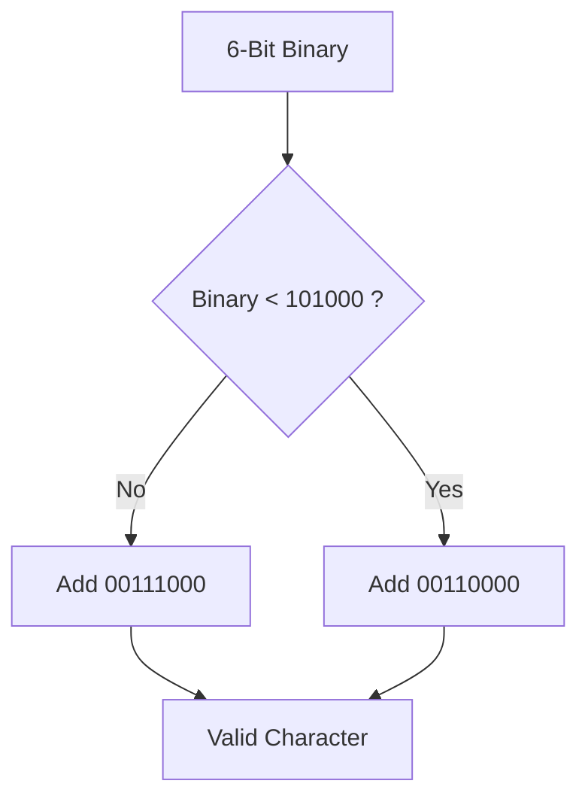
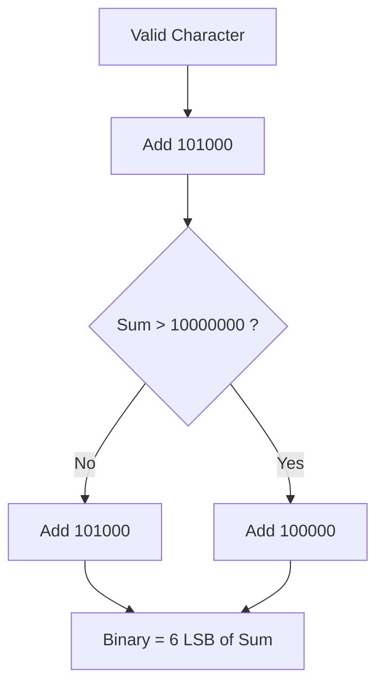

###### tags: `webdoc`

# AMEC AIS AtoN Remote Control

[ToC]

This document describe how to use the AMEC AIS AtoN to remote control and monitor a remote device.

## Introduction

In order to let onshore control center to control and monitor the offshore remote device, the AIS AtoN provides a feature to let the user send data from onshore to a remote device.

This document provides a mechanism to remote control a remote device by the AMEC AIS AtoN. With this mechanism, the AIS AtoN is designed to set up as a virtual tunnel to transport the “control data” payload from source station to destination without decoding the data format of various types of command. The advantage of this mechanism is that it can be compatible with various types of lanterns/devices without having to know the proprietary data format of different manufactures.

---

### Abstracts I

The control center needs to control and monitor a remote device.
Assume the control center is a PC.



---

### Abstracts II

The AIS AtoN response forward/transfer data from the control center to the remote device.



### Sequence Chart

The control center use the NMEA0183 ABM sentence to trigger an AIS message transmit.



---

### Flow Chart

Here is a flow chart that control center task.



---

## Background

The control center uses the NMEA0183 ABM sentence to warp control command and feed the sentence to the AIS AtoN. The AIS AtoN does not need to understand the control command.

### NMEA0183 ABM

<b>AIS Addressed Binary and Safety Related Message</b>

This sentence supports ITU-R M.1371 messages 6, 12, 25 and 26 and provides an external application with a means to exchange data via an AIS transponder. Data is defined by the application only, not the AIS unit. This sentence offers great flexibility for implementing system functions that use the transponder like a communications device. After receiving this sentence via the NMEA 0183 interface, the transponder initiates a VDL broadcast of message 6, 12, 25, or 26. The AIS unit will make up to four broadcasts of message 6 and 12. The actual number will depend on the reception of an acknowledgement from the addressed "destination" AIS unit. The success or failure of reception of this transmission by the addressed AIS unit for messages 6 and 12 is confirmed through the use of the "Addressed Binary and safety related message Acknowledgement" ABK sentence formatter, and the processes that supports the generation of an ABK sentence. The AIS transponder determines the appropriate communications state for transmission of message 26 over the VHF data Link.

```
!--ABM,x,x,x,xxxxxxxxx,x,xx,s--s,x*hh<CR><LF>
```

|Field|Type|Name|Note|
|-|-|-|-|
|0|`!--ABM`|||
|1|`x`|Total number of sentences needed to transfer the message, 1 ~ 9|The total number of sentences required to transfer the binary message data to the AIS unit.<br>* The first field specifies the total number of sentences used for a message, minimum value 1.<br>* The second field identifies the order of this sentence in the message, minimum value 1.<br>* All sentences contain the same number of fields. Successive sentences may use null fields for fields that have not changed, such as fields 4, 5, and 6.|
|2|`x`|Sentence number, 1 ~ 9| see above|
|3|`x`|Sequential message identifier, 0 ~ 3|This sequential message identifier serves two purposes. It meets the requirements as stated in Section 5.3.4 of this standard, and it is the sequence number utilized by ITU-R M.1371 in message types 6 and 12. The range of this field is restricted by ITU-R M1371 to 0 - 3. The sequential message identifier value may be reused after the AIS unit provides the "ABK" acknowledgement for this number. (See ABK Sentence).|
|4|`xxxxxxxxx`|The MMSI of the destination AIS unit for the ITU-R M.1371 message|The MMSI of the AIS unit that is the destination of the message.|
|5|`x`|AIS channel for broadcast of the radio message|The AIS channel that shall be used for the broadcast:<br>0 = no broadcast channel preference,<br>1 = Broadcast on AIS channel A,<br>2 = Broadcast on AIS channel B,<br>3 = Broadcast message on both AIS channels A and B.|
|6|`xx`|ITU-R M.1371 message Id|The ITU-R M.1371 message Id for the following addressed messages:<br>6 = Binary addressed message,<br>12 = Addressed safety related message,<br>25 = Single slot binary message 25 (binary data coded using the 16-bit Application identifier),<br>70 = Single slot binary message 25 (unstructured binary data),<br>26 = Multiple slot binary message 26 with Communications State (binary data coded using the 16-bit Application identifier),<br>71 = Multiple slot binary message 26 with Communications State (unstructured binary data).|
|7|`x--x`|Encapsulated data|This is the content of the "binary data" parameter for ITU-R M.1371 message 6, or the "Safety related Text" parameter for message 12, or the "binary data" parameter for message 25, or the "binary data" parameter for message 26. The first sentence may contain up to 48 valid Six Bit codes (288 bits). Following sentences may contain up to 60 valid Six Bit codes (360 bits), if fields 4, 5, and 6 are unchanged from the first sentence and set to null. The actual number of valid characters must be such that the total number of characters in a sentence does not exceed the “82-character” limit.|
|8|`x`|number of fill-bits|This cannot be a null field.|
|9|`hh`|checksum||

### AIS Message Format

The follow table is the message format for remote control of the remote devices. The control command will be filled in the “Payload” field of the message.

| Field No | Parameter | Number of bits | Description | Overall bits|
| :--: | -- | :--: | -- | :--: |
| 1 | Message ID | 6 |Identifier for Message 6; always 6 | 6|
| 2 | Repeat indicator | 2 | Set to 0 | 8 |
| 3 | Source Id | 30 |  MMSI of station broadcasting message | 38 |
| 4 | Sequence number | 2 | Set to 0 | 40 |
| 5 | Destination Id | 30 | Set to 0 | 70 |
| 6 | Retransmit flag | 1 |Set to 0 | 71 |
| 7 | Spare | 1 | Set to 0 | 72|
| 8 | DAC | 10 | Set to 990 | 82|
| 9 | FI | 6 | Set to 20/22 | 88|
| 10 | DAC | 10 |Set to 990 | 98 |
| 11 | FI | 6 | Set to 20/22 | 104 |
| 12 | MMSI of AtoN | 30 | MMSI of responding AtoN | 134 |
| 13 | Type | 2 | Set to 0 | 136 |
| 14 | Payload | 8 x N | N = 1 ~ 80 | 136+(8xN) |
|  | Maximum number of bits | 136 ~ 776 | Slot occupies 1~3 slots | 136+(8xN) |

FI 20 used for remote control.  
FI 22 used for response.

## Example

### Example Scenario

| | AtoN 1| AtoN 2 |
| -- | -- | -- |
| AtoN Type | AIS AtoN Type 3 | AIS AtoN Type 3 |
| Real MMSI | 990123456 | 990111111 |
| Chain Child MMSI | 990111111 | |

### Example Pattern

| Direction | Pattern |
| -- | :-- |
| AtoN 1 -> AtoN 2| `$AIAIQ,VER*3C<CR><LF>`|
| AtoN 2 -> AtoN 1| `$ANVER,1,1,AN,AMC,987654321,SERAILNO,MODEL,SWVERSION,HWVERSION,*7A<CR><LF>`|

### Send data to Remote AtoN Sequence Chart



#### (1) Get ABM Sentence

The user send NMEA0183 ABM sentence to the AotN 1.

```
!ANABM,1,1,0,000000000,0,06,uqCoU>h?UQhT@DU1BE4dETEB:S=33@`,2*3C
```

#### (2) Transmit AIS Message

The AtoN 1 transmit the AIS message 6 within 4 seconds.

```
!ANVDO,1,1,0,A,6>h@Eh000000uqCoU>h?UQhT@DU1BE4dETEB:S=33@`,2*65
```

#### (3) Receive AIS Message

The AtoN 2 receive the AIS message.

```
!ANVDM,1,1,7,A,6>h@Eh000000uqCoU>h?UQhT@DU1BE4dETEB:S=33@`,2*60
```

#### (4) Retrieve and output payload

The AtoN 2 decode the AIS message, retrieve the payload, than output the payload. The output data will surround by `<CR><LF>`.

```
<CR><LF>
$AIAIQ,VER*3C<CR><LF>
<CR><LF>
```

#### (5) Transmit ACK message

The AtoN 2 transmit the AIS message 7 for acknowledgement.

```
!ANVDO,1,1,8,A,7>h?UQkd45L0,0*33
```

#### (6) Receive ACK message

The AtoN 1 receive the acknowledgement.

```
!ANVDM,1,1,1,A,7>h?UQkd45L0,0*38
```

### Remote AtoN Response Sequence Chart



#### (1) Get payload

Assume the remote AtoN 2 get a payload as below from remote device.

```
$ANVER,1,1,AN,AMC,987654321,SERAILNO,MODEL,SWVERSION,HWVERSION,*7A
```

#### (2) Transmit AIS Message 6

The AtoN 2 will warp the payload and transmit the AIS message.

```
!ANVDO,2,1,2,A,6>h?UQh00000uqKoUfh?UQhT@DqFAE8d<Bhi;45>;45=@jhq>3Ln=C@k<S4d,0*0C
!ANVDO,2,2,2,A,DlEB@DU<CTtdCDu4ADhdDmMFAE9CBDu>;4QGETEBDlU?CRhb=T4=2P,4*5A
```

#### (3) Receive AIS Message 6

The AtoN 1 receive the AIS message.

```
!ANVDM,2,1,0,A,6>h?UQh00000uqKoUfh?UQhT@DqFAE8d<Bhi;45>;45=@jhq>C0i<S<l=CHd,0*00
!ANVDM,2,2,0,A,;459Djm1E4u>;E@k;5Hj;S0f<Rpl;E@i;4=DC4q3<m96CU8j;2`o@@l:,0*31
```

#### (4) Retrieve payload and output

The AtoN 1 decode the AIS message, retrieve the payload, then output the payload. The outputted payload will surround by `<CR><LF>`.

```
<CR><LF>
$ANVER,1,1,AN,AMC,990123456,,AIS-ATON-T3,V2.0.2.4-T1,CTLNC3RFNR2,*7A<CR><LF>
<CR><LF>
```

#### (5) Transmit AIS ack message

The AtoN 1 transmit the AIS message 7 for acknowledgement.

```
!ANVDO,1,1,1,A,7>h@Eh3d3qHL,0*0
```

#### (6) Receive AIS ack message

The AtoN 2 receive the acknowledgement AIS message.

```
!ANVDM,1,1,9,A,7>h@Eh3d3qHL,0*05
```

## Appendix

### NMEA0183 ABM Sentence Generating

Assume the remote AIS AtoN station (AtoN 2 ) MMSI is 990111111.
The command that needs to transfer to the remote device is `$AIAIQ,VER*3C<CR><LF>`. The NMEA0183 ABM sentence is generated in the following steps.

### Step 1, Set all parameter of AIS Message 6

The encapsulation data contain the binary data field of AIS messages 6. Start from field 8 to 14 of AIS Message 6.

|Field No | Parameter | Number of Bit | Decimal Value | Binary |
| :--: | :--: | :--: | --: | -- |
| 8 | DAC | 10 | 990 | `1111011110` |
| 9 | FI | 6 | 20 | `010100` |
| 10 | DAC | 10 | 990 | `1111011110` |
| 11 | FI | 6 | 20 | `010100` |
| 12 | MMSI | 30 | 990111111 | `111011000000111110010110000111` |
| 13 | Type | 2 | 0 | `00` |

The field 14 list in following table.

| ASCII | Hex | Binary |
| :--: | -- | -- |
| $ | 24 | `00100100` |
| A | 41 | `01000001` |
| I | 49 | `01001001` |
| A | 41 | `01000001` |
| I | 49 | `01001001` |
| Q | 51 | `01010001` |
| , | 2C | `00101100` |
| V | 56 | `01010110` |
| E | 45 | `01000101` |
| R | 52 | `01010010` |
| * | 2A | `00101010` |
| 3 | 33 | `00110011` |
| C | 43 | `01000011` |
| `<CR>` | 0D | `00001101` |
| `<LF>` | 0A | `00001010` |

### Step 2, Generate the Binary Data

Concatenate field from 8 to 14 binary data.

`1111011110` `010100` `1111011110` `010100` `111011000000111110010110000111` `00` `00100100` `01000001` `01001001` `01000001` `01001001` `01010001` `00101100` `01010110` `01000101` `01010010` `00101010` `00110011` `01000011` `00001101` `00001010`

```text
1111011110010100111101111001010011101100000011111001011000011100001001000100000101001001010000010100100101010001001011000101011001000101010100100010101000110011010000110000110100001010
```

### Step 3, Generate the Encapsulation Data

The encapsulation data is in 6-bit valid character. Padding 2 `0` at the end to meet 6-bit boundary.

```text
111101111001010011110111100101001110110000001111100101100001110000100100010000010100100101000001010010010101000100101100010101100100010101010010001010100011001101000011000011010000101000
```

Convert each 6-bit binary data to a valid character.

| Binary | Valid Value | Valid character |
| -- | -- | :--: |
| 111101 | 01110101 | u |
| 111001 | 01110001 | q |
| 010011 | 01000011 | C |
| 110111 | 01101111 | o |
| 100101 | 01010101 | U |
| 001110 | 00111110 | > |
| 110000 | 01101000 | h |
| 001111 | 00111111 | ? |
| 100101 | 01010101 | U |
| 100001 | 01010001 | Q |
| 110000 | 01101000 | h |
| 100100 | 01010100 | T |
| 010000 | 01000000 | @ |
| 010100 | 01000100 | D |
| 100101 | 01010101 | U |
| 000001 | 00110001 | 1 |
| 010010 | 01000010 | B |
| 010101 | 01000101 | E |
| 000100 | 00110100 | 4 |
| 101100 | 01100100 | d |
| 010101 | 01000101 | E |
| 100100 | 01010100 | T |
| 010101 | 01000101 | E |
| 010010 | 01000010 | B |
| 001010 | 00111010 | : |
| 100011 | 01010011 | S |
| 001101 | 00111101 | = |
| 000011 | 00110011 | 3 |
| 000011 | 00110011 | 3 |
| 010000 | 01000000 | @ |
| 101000 | 01100000 | ` |

The encapsulate data field of NMEA0183 ABM sentence will be like this.

```
uqCoU>h?UQhT@DU1BE4dETEB:S=33@`
```

### Step 4, Generate NMEA0183 ABM sentence

Each field of NMEA0183 ABM

| Field | Type | Content| Comment|
| -- | -- | -- | -- |
|0|`!--ABM`| `!ANABM`| Fixed value|
|1|`x`| `1` | only 1 sentence |
|2|`x`| `1` | only 1 sentence |
|3|`x`| `0` | |
|4|`xxxxxxxxx`| `000000000` | Not used, leave it in default value|
|5|`x`| `0` | Not specif which AIS channel to transmit.|
|6|`xx`| `06` | Use AIS message 6 |
|7|`x--x`| uqCoU>h?UQhT@DU1BE4dETEB:S=33@`|Encapsulation data|
|8|`x`|`2`|No of fill bit |
|9|`hh`|checksum|XOR all characters between `!` to `*`|

The final NMEA0183 ABM sentence will this

```
!ANABM,1,1,0,000000000,0,06,uqCoU>h?UQhT@DU1BE4dETEB:S=33@`,2*3C
```

### Step 5, Send to AIS AtoN

Send the NMEA0183 ABM sentence to the AIS AtoN to trigger a AIS message transmit.

### Six-bit Binary Conversion Table

| Valid character | Binary field | Valid character | Binary field |
| :--: | -- | :--: | -- |
| 0 | 000000 | P | 100000 |
| 1 | 000001 | Q | 100001 |
| 2 | 000010 | R | 100010 |
| 3 | 000011 | S | 100011 |
| 4 | 000100 | T | 100100 |
| 5 | 000101 | U | 100101 |
| 6 | 000110 | V | 100110 |
| 7 | 000111 | W | 100111 |
| 8 | 001000 | ` | 101000 |
| 9 | 001001 | a | 101001 |
| : | 001010 | b | 101010 |
| ; | 001011 | c | 101011 |
| < | 001100 | d | 101100 |
| = | 001101 | e | 101101 |
| > | 001110 | f | 101110 |
| ? | 001111 | g | 101111 |
| @ | 010000 | h | 110000 |
| A | 010001 | i | 110001 |
| B | 010010 | j | 110010 |
| C | 010011 | k | 110011 |
| D | 010100 | l | 110100 |
| E | 010101 | m | 110101 |
| F | 010110 | n | 110110 |
| G | 010111 | o | 110111 |
| H | 011000 | p | 111000 |
| I | 011001 | q | 111001 |
| J | 011010 | r | 111010 |
| K | 011011 | s | 111011 |
| L | 011100 | t | 111100 |
| M | 011101 | u | 111101 |
| N | 011110 | v | 111110 |
| O | 011111 | w | 111111 |

### Code 6-bit binary value to valid NMEA0183 character



### Decode Valid NMEA0183 character to 6-bit binary value



## Reference

* <a id="m1371"></a>ITU-R M.1371: Technical characteristics for an automatic identification system using time-division multiple access in the VHF maritime mobile band.
[https://www.itu.int/rec/R-REC-M.1371/en](https://www.itu.int/rec/R-REC-M.1371/en)

* <a id="nmea0183"></a>NMEA-0183: Standard for Interfacing Marine Electronic Devices
[https://www.nmea.org/content/STANDARDS/NMEA_0183_Standard](https://www.nmea.org/content/STANDARDS/NMEA_0183_Standard)

* <a id="iec_62320_2"></a>IEC 62320-2 2016: Maritime navigation and radiocommunication equipment and systems - Automatic identification system (AIS) - Part 2: AIS AtoN Stations - Operational and performance requirements, methods of testing and required test results.
[https://webstore.iec.ch/publication/26132](https://webstore.iec.ch/publication/26132)

* <a id="iala_a126"></a>IALA A-126: The Use of the Automatic Identification System (AIS) in Marine Aids to Navigation Services.
[https://www.iala-aism.org/product/use-of-the-ais-in-marine-aids-to-navigation-service-126/](https://www.iala-aism.org/product/use-of-the-ais-in-marine-aids-to-navigation-service-126/)
