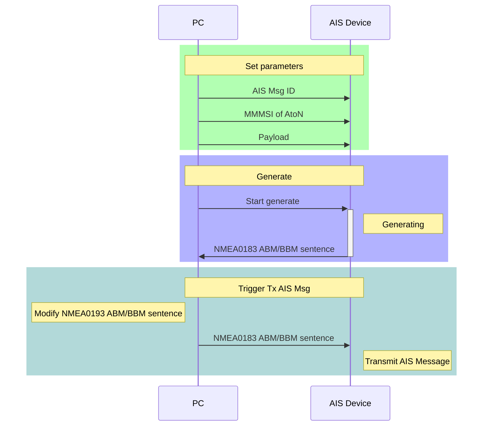
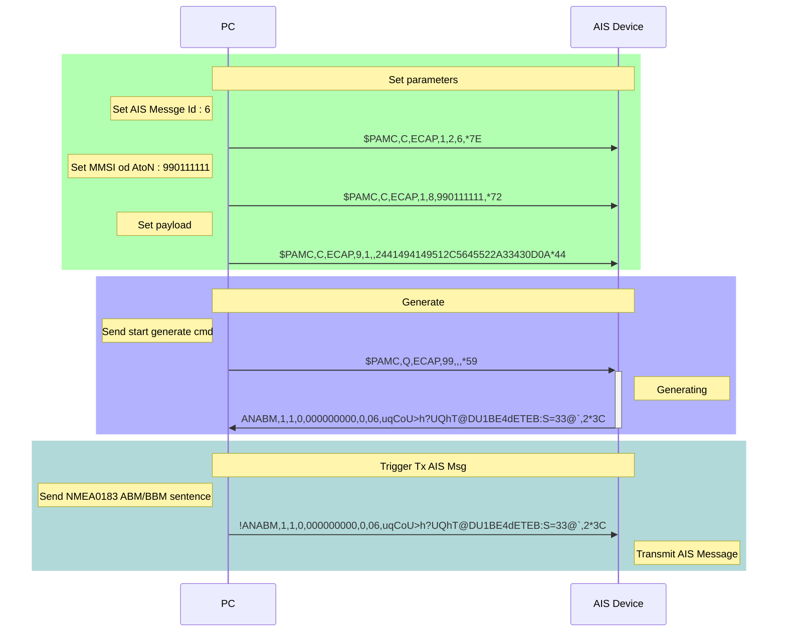
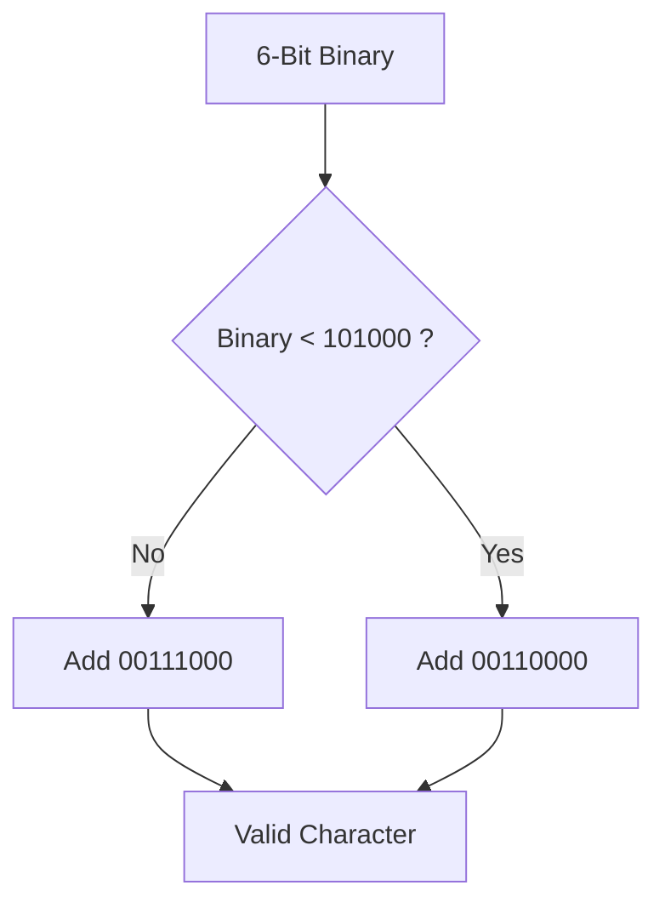
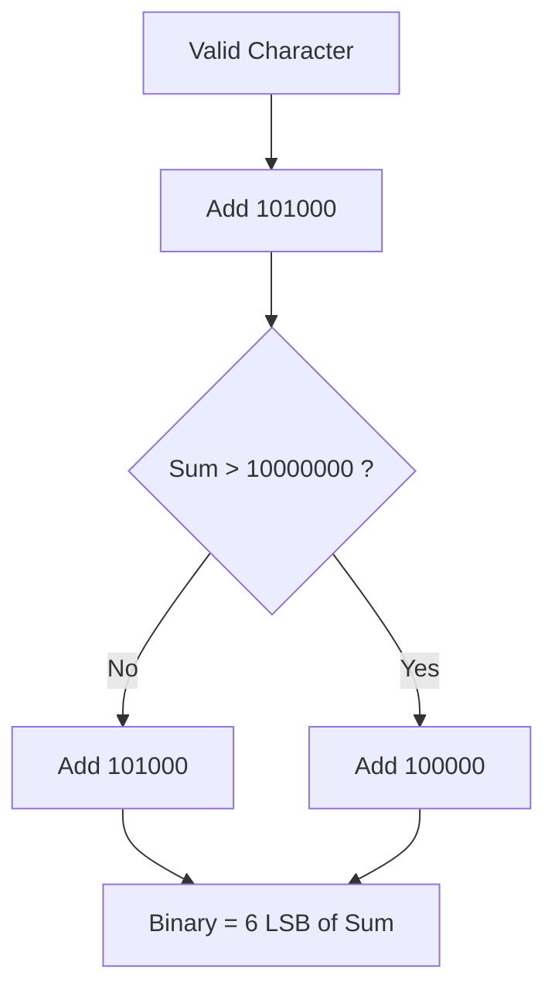

###### tags: `webdoc`

# AMEC PAMC Ecap

[Toc]

## Introduction

This document illustrate the PAMC formatter support by AMEC AIS AtoN.

In order to let user to customize AIS message 6 payload without knowing NMEA0183 ABM/BBM sentence format, we provide a ABM/BBM generator to generate NMEA0183 ABM/BBM sentence.

The user needs to set all parameter of ABM/BBM sentence.



## NMEA0183 Proprietary Sentences

The AMEC manufacturer's mnemonic code is `AMC`. The proprietary NMEA0183 sentence will start with `$PAMC`. The sentence format of the `ECAP` of `$PAMC` is described below that provide a interface allow the user to set ABM/BBM parameters.

```text
$PAMC,a,ECAP,x.x,x.x,x.x,s--s*hh<CR><LF>
```

| Field | Type | Name | Note |
| -- | -- | -- | -- |
| 0 | `$PAMC` || fixed value|
| 1 | `a` |Sentence status flag|This field is used to indicate a sentence that is a status report of current settings or a configuration command changing settings. This field should not be null.<br>R = Sentence is a status report of current settings (use for a reply to a query).<br>C = Sentence is a configuration command to change settings. A sentence without "C" is not a command.<br>Q = query this ID settings.|
| 2 | `ECAP`|| fixed value|
| 3 | `x.x` | ID||
| 4 | `x.x` | SubID||
| 5 | `x.x` | Value||
| 6 | `s---s` | string||
| 7 | `hh` | checksum||

---

## ID=1, General Parameter

```text
$PAMC,C,ECAP,1,SubId,Value,String*hh<CR><LF>
```

| SubId | Value| String | Note |
| -- | -- | -- | -- |
| 1 | 0~999999999 | -- | Source Id |
| 2 | 1~27 | -- | AIS Message Id |
| 3 | 0~7 | -- | AIS Message Id Index |
| 4 | 0~999999999 | -- | Destination Id|
| 6 | 0~3 | -- | AIS channel for broadcast of the radio message<br/>0: Auto<br/>1: AIS Channel A<br/>2: AIS Channel B<br/>3: AIS Channel A and B|
| 8 | 0~999999999 | -- | MMSI of AtoN |
| 9 | --- | `ABM` | NMEA0183 formatter|


---

## ID=9, Hex Data Parameter

```text
$PAMC,C,ECAP,9,SubId,,String*hh<CR><LF>
```

| SubId | String | Note |
| -- | -- | -- |
| 1~9 | 0~F | Source Id |

---

## ID=99, Generate Sentence

```text
$PAMC,Q,ECAP,99,,,*hh<CR><LF>
```

---

## Appendix

### Example

Assume the remote AIS AtoN Station MMSI is 990111111, the user need send `$AIAIQ,VER*3C<CR><LF>` to the remote device. Here is the parameters.

| Item | Parameter |
| -- | -- |
| AIS Message ID | 6 |
| MMSI of AtoN | 990111111 |
| Payload | `$AIAIQ,VER*3C<CR><LF>` |

Calculate and set the payload in hexadecimal.

| ASCII | Hex |
| -- | -- |
| $ | 24 |
| A | 41 |
| I | 49 |
| A | 41 |
| I | 49 |
| Q | 51 |
| , | 2C |
| V | 56 |
| E | 45 |
| R | 52 |
| * | 2A |
| 3 | 33 |
| C | 43 |
| `<CR>` | 0D |
| `<LF>` | 0A |

The configure of `PAMC` sentences are list below.

```
$PAMC,C,ECAP,1,1,990123456,*7C
$PAMC,C,ECAP,1,2,6,*7E
$PAMC,C,ECAP,1,8,990111111,*72
$PAMC,C,ECAP,9,1,,2441494149512C5645522A33430D0A*44
```

Query and check all parameters.

```
$PAMC,Q,ECAP,0,,,*69
```

The device will response all parameters. Make sure the MMSI of AtoN and the payload are correct.

```
$PAMC,R,ECAP,1,1,990123456,Source Id*5D
$PAMC,R,ECAP,1,2,6,Msg Id*3B
$PAMC,R,ECAP,1,6,0,Ch 0:Auto 1:A 2:B 3:AB*69
$PAMC,R,ECAP,1,8,990111111,MMSI of AtoN*64
$PAMC,R,ECAP,9,1,,2441494149512C5645522A33430D0A*55
```

Send start generate command.

```text
$PAMC,Q,ECAP,99,,,*59
```

The device will response NMEA0183 ABM/BBM sentence.

```text
#ANABM,1,1,0,000000000,0,06,uqCoU>h?UQhT@DU1BE4dETEB:S=33@`,2*3C
```

Change the first character from sharp/pound/hash `#` to exclamation mark `!`.

```text
!ANABM,1,1,0,000000000,0,06,uqCoU>h?UQhT@DU1BE4dETEB:S=33@`,2*3C
```

Send the NMEA0183 ABM/BBM sentence to the AIS device to trigger transmit and output a `!ANVOD` sentence.

```
!ANVDO,1,1,1,A,6>h@Eh000000uqCoU>h?UQhT@DU1BE4dETEB:S=33@`,2*64
```

#### Sequence Chart

Here is the sequence chart describe provide section



### ABM Generation step by step

Assume the remote AtoN stations MMSI is 990111111.
The command that need to send to remote device is `$AIAIQ,VER*3C<CR><LF>`.

| Field Name | Number of Bit | Decimal Value | Binary |
| -- | -- | -- | -- |
| DAC | 10 | 990 | `1111011110` |
| FI | 6 | 20 | `010100` |
| DAC | 10 | 990 | `1111011110` |
| FI | 6 | 20 | `010100` |
| MMSI of AtoN| 30 | 990111111 | `111011000000111110010110000111` |
| Type | 2 | 0 | `00` |

The payload data.

| ASCII | Hex | Binary |
| -- | -- | -- |
| $ | 24 | `00100100` |
| A | 41 | `01000001` |
| I | 49 | `01001001` |
| A | 41 | `01000001` |
| I | 49 | `01001001` |
| Q | 51 | `01010001` |
| , | 2C | `00101100` |
| V | 56 | `01010110` |
| E | 45 | `01000101` |
| R | 52 | `01010010` |
| * | 2A | `00101010` |
| 3 | 33 | `00110011` |
| C | 43 | `01000011` |
| `<CR>` | 0D | `00001101` |
| `<LF>` | 0A | `00001010` |

Concatenate all binary data

`1111011110` `010100` `1111011110` `010100` `111011000000111110010110000111` `00` `00100100` `01000001` `01001001` `01000001` `01001001` `01010001` `00101100` `01010110` `01000101` `01010010` `00101010` `00110011` `01000011` `00001101` `00001010`

The bit stream of binary data

```text
1111011110010100111101111001010011101100000011111001011000011100001001000100000101001001010000010100100101010001001011000101011001000101010100100010101000110011010000110000110100001010
```

Padding 2 bit with zero `0` at the end to let the bit stream meet 6-bit boundary.

```text
111101111001010011110111100101001110110000001111100101100001110000100100010000010100100101000001010010010101000100101100010101100100010101010010001010100011001101000011000011010000101000
```

Convert each 6-bit of binary data to a valid character.

`111101` `111001` `010011` `110111` `100101` `001110` `110000` `001111` `100101` `100001` `110000` `100100` `010000` `010100` `100101` `000001` `010010` `010101` `000100` `101100` `010101` `100100` `010101` `010010` `001010` `100011` `001101` `000011` `000011` `010000` `101000`


| Binary | Valid character value | Valid character |
| -- | -- | :--: |
| 111101 | 01110101 | u |
| 111001 | 01110001 | q |
| 010011 | 01000011 | C |
| 110111 | 01101111 | o |
| 100101 | 01010101 | U |
| 001110 | 00111110 | > |
| 110000 | 01101000 | h |
| 001111 | 00111111 | ? |
| 100101 | 01010101 | U |
| 100001 | 01010001 | Q |
| 110000 | 01101000 | h |
| 100100 | 01010100 | T |
| 010000 | 01000000 | @ |
| 010100 | 01000100 | D |
| 100101 | 01010101 | U |
| 000001 | 00110001 | 1 |
| 010010 | 01000010 | B |
| 010101 | 01000101 | E |
| 000100 | 00110100 | 4 |
| 101100 | 01100100 | d |
| 010101 | 01000101 | E |
| 100100 | 01010100 | T |
| 010101 | 01000101 | E |
| 010010 | 01000010 | B |
| 001010 | 00111010 | : |
| 100011 | 01010011 | S |
| 001101 | 00111101 | = |
| 000011 | 00110011 | 3 |
| 000011 | 00110011 | 3 |
| 010000 | 01000000 | @ |
| 101000 | 01100000 | ` |

Concatenate all valid characters into a string.

```
uqCoU>h?UQhT@DU1BE4dETEB:S=33@`
```

Add rest NMEA0183 ABM/BBM field.

```
#ANABM,1,1,0,000000000,0,06,uqCoU>h?UQhT@DU1BE4dETEB:S=33@`,2*3C
```

---

### AIS Message Format

The follow table is the message format for remote control of the remote devices. The control command will be filled in the “Payload” field of this message.

| Parameter | Number of bits | Description | Overall bits|
| -- | -- | -- | -- |
| Message ID | 6 |Identifier for Message 6; always 6 | 6|
| Repeat indicator | 2 | Set to 0 | 8 |
| Source Id | 30 |  MMSI of station broadcasting message | 38 |
| Sequence number | 2 | Set to 0 | 40 |
| Destination Id | 30 | Set to 0 | 70 |
| Retransmit flag | 1 |Set to 0 | 71 |
| Spare | 1 | Set to 0 | 72|
| DAC | 10 | Set to 990 | 82|
| FI | 6 | Set to 20/22 | 88|
| DAC | 10 |Set to 990 | 98 |
| FI | 6 | Set to 20/22 | 104 |
| MMSI of AtoN | 30 | MMSI of responding AtoN | 134 |
| Type | 2 | Set to 0 | 136 |
| Payload | 8*N | N = 1 ~ 80 | 136+8*N |
| Maximum number of bits | Maximum 136~776 | Slot occupies 1~3 slots | 136+8*N |

### Six-bit Binary Conversion Table

| Valid character | Binary field | Valid character | Binary field |
| :--: | -- | :--: | -- |
| 0 | 000000 | P | 100000 |
| 1 | 000001 | Q | 100001 |
| 2 | 000010 | R | 100010 |
| 3 | 000011 | S | 100011 |
| 4 | 000100 | T | 100100 |
| 5 | 000101 | U | 100101 |
| 6 | 000110 | V | 100110 |
| 7 | 000111 | W | 100111 |
| 8 | 001000 | ` | 101000 |
| 9 | 001001 | a | 101001 |
| : | 001010 | b | 101010 |
| ; | 001011 | c | 101011 |
| < | 001100 | d | 101100 |
| = | 001101 | e | 101101 |
| > | 001110 | f | 101110 |
| ? | 001111 | g | 101111 |
| @ | 010000 | h | 110000 |
| A | 010001 | i | 110001 |
| B | 010010 | j | 110010 |
| C | 010011 | k | 110011 |
| D | 010100 | l | 110100 |
| E | 010101 | m | 110101 |
| F | 010110 | n | 110110 |
| G | 010111 | o | 110111 |
| H | 011000 | p | 111000 |
| I | 011001 | q | 111001 |
| J | 011010 | r | 111010 |
| K | 011011 | s | 111011 |
| L | 011100 | t | 111100 |
| M | 011101 | u | 111101 |
| N | 011110 | v | 111110 |
| O | 011111 | w | 111111 |

#### Code 6-bit binary value to valid NMEA0183 character



#### Decode Valid NMEA0183 character to 6-bit binary value



---

### ABM - AIS Addressed Binary and Safety Related Message

This sentence supports ITU-R M.1371 messages 6, 12, 25 and 26 and provides an external application with a means to exchange data via an AIS transponder. Data is defined by the application only, not the AIS unit. This sentence offers great flexibility for implementing system functions that use the transponder like a communications device. After receiving this sentence via the NMEA 0183 interface, the transponder initiates a VDL broadcast of message 6, 12, 25, or 26. The AIS unit will make up to four broadcasts of message 6 and 12. The actual number will depend on the reception of an acknowledgement from the addressed "destination" AIS unit. The success or failure of reception of this transmission by the addressed AIS unit for messages 6 and 12 is confirmed through the use of the "Addressed Binary and safety related message Acknowledgement" ABK sentence formatter, and the processes that supports the generation of an ABK sentence. The AIS transponder determines the appropriate communications state for transmission of message 26 over the VHF data Link.

```text
!--ABM,x,x,x,xxxxxxxxx,x,xx,s--s,x*hh<CR><LF>
```

|Field|Type|Name|Note|
|-|-|-|-|
|0|`!--ABM`|||
|1|`x`|Total number of sentences needed to transfer the message, 1 ~ 9|The total number of sentences required to transfer the binary message data to the AIS unit.<br>* The first field specifies the total number of sentences used for a message, minimum value 1.<br>* The second field identifies the order of this sentence in the message, minimum value 1.<br>* All sentences contain the same number of fields. Successive sentences may use null fields for fields that have not changed, such as fields 4, 5, and 6.|
|2|`x`|Sentence number, 1 ~ 9| see above|
|3|`x`|Sequential message identifier, 0 ~ 3|This sequential message identifier serves two purposes. It meets the requirements as stated in Section 5.3.4 of this standard, and it is the sequence number utilized by ITU-R M.1371 in message types 6 and 12. The range of this field is restricted by ITU-R M1371 to 0 - 3. The sequential message identifier value may be reused after the AIS unit provides the "ABK" acknowledgement for this number. (See ABK Sentence).|
|4|`xxxxxxxxx`|The MMSI of the destination AIS unit for the ITU-R M.1371 message|The MMSI of the AIS unit that is the destination of the message.|
|5|`x`|AIS channel for broadcast of the radio message|The AIS channel that shall be used for the broadcast:<br>0 = no broadcast channel preference,<br>1 = Broadcast on AIS channel A,<br>2 = Broadcast on AIS channel B,<br>3 = Broadcast message on both AIS channels A and B.|
|6|`xx`|ITU-R M.1371 message Id|The ITU-R M.1371 message Id for the following addressed messages:<br>6 = Binary addressed message,<br>12 = Addressed safety related message,<br>25 = Single slot binary message 25 (binary data coded using the 16-bit Application identifier),<br>70 = Single slot binary message 25 (unstructured binary data),<br>26 = Multiple slot binary message 26 with Communications State (binary data coded using the 16-bit Application identifier),<br>71 = Multiple slot binary message 26 with Communications State (unstructured binary data).|
|7|`x--x`|Encapsulated data|This is the content of the "binary data" parameter for ITU-R M.1371 message 6, or the "Safety related Text" parameter for message 12, or the "binary data" parameter for message 25, or the "binary data" parameter for message 26. The first sentence may contain up to 48 valid Six Bit codes (288 bits). Following sentences may contain up to 60 valid Six Bit codes (360 bits), if fields 4, 5, and 6 are unchanged from the first sentence and set to null. The actual number of valid characters must be such that the total number of characters in a sentence does not exceed the “82-character” limit.|
|8|`x`|number of fill-bits|This cannot be a null field.|
|9|`hh`|checksum||

### VDO - AIS VHF Data-Link Own-Vessel Report

This sentence is used to transfer the entire contents of an AIS unit's broadcast message packet, as defined in ITU-R M.1371 and as sent out by the AIS unit over the VHF Data Link (VDL), using the "Six Bit" field type. The structure provides for the transfer of long binary messages by using multiple sentences. The sentence uses the same structure as the VDM sentence formatter.

```text
!--VDO,x,x,x,a,s--s,x*hh<CR><LF>
```

|Field|Type|Name|Note|
|-----|----|----|----|
| 0| `!--VDO`| ||
| 1| `x`| Total number of sentences needed to transfer the message, 1 to 9| The length of an ITU-R M.1371 message may require the transmission of multiple sentences.<br>* The first field specifies the total number of sentences used for a message, minimum value 1.<br>* The second field identifies the order of this sentence in the message, minimum value 1.<br>These cannot be null fields.|
| 2| `x`| Sentence number, 1 to 9| The length of an ITU-R M.1371 message may require the transmission of multiple sentences.<br>* The first field specifies the total number of sentences used for a message, minimum value 1.<br>* The second field identifies the order of this sentence in the message, minimum value 1.<br>These cannot be null fields.|
| 3| `x`| Sequential message identifier, 0 to 9| The Sequential message identifier provides a message identification number from 0 to 9 that is sequentially assigned and is incremented for each new multi-sentence message. The count resets to 0 after 9 is used. For a message requiring multiple sentences, each sentence of the message contains the same sequential message identification number. It is used to identify the sentences containing portions of the same message. This allows for the possibility that other sentences might be interleaved with the message sentences that, taken collectively,contain a single message. This may be a null field for messages that fit into one sentence.|
| 4| `a`| AIS Channel| The AIS channel is indicated as either A or B. This channel indication is relative to the operating conditions of the transponder when the packet is received. This shall be a null field when the channel identification is not provided. The frequencies for channels A and B are obtained by a query of the AIS unit for an ACA sentence(s).|
| 5| `s--s`| Encapsulated ITU-R M.1371 radio message| This field supports a maximum of 60 valid characters for messages transferred using multiple sentences, and 62 valid characters for messages using a single sentence.|
| 6| `x`| Number of fill-bits, 0 to 5| This cannot be a null field. |
| 7 | `hh`| Checksum| |
